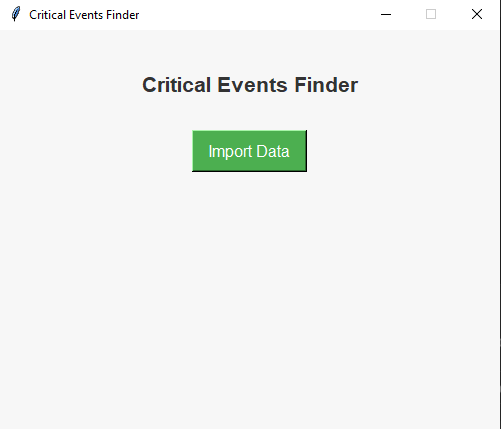
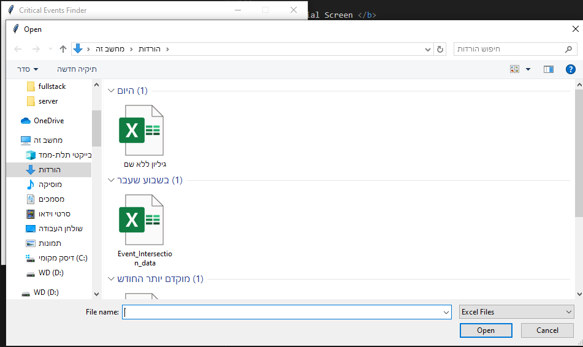
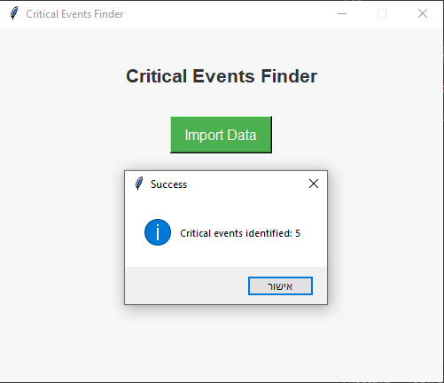
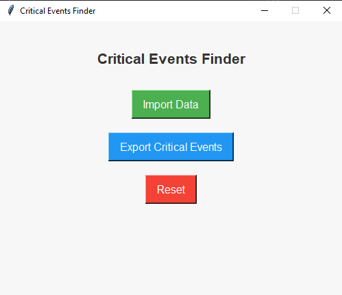
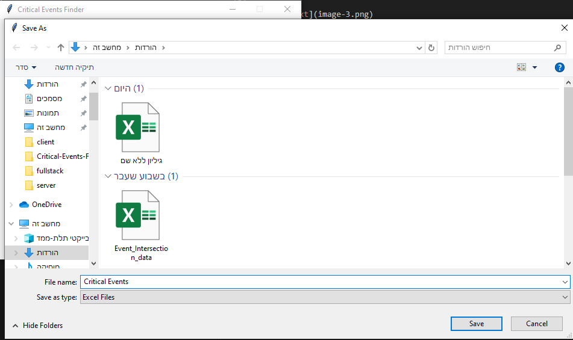

# Critical Events Finder

Critical Events Finder is a Python-based desktop application that identifies critical events from imported data (in .xlsx or .json formats). Users can import data, process it to identify critical events, and export the results in an Excel file. The application uses a simple, user-friendly interface built with tkinter.

## Table of Contents

- [Project Overview](#project-overview)
- [Features](#features)
- [Prerequisites](#prerequisites)
- [Installation](#installation)
- [Usage](#usage)
- [Data Formats](#data-formats)
- [File Structure](#file-structure)
- [Screenshots](#screenshots)
- [Video demo](#video-demo)

## Project Overview

The <code>find_critical_events</code> function takes a list of days, where each day is represented by a list of tuples. Each tuple contains an intersection and an event observed at that intersection on that day. The function identifies events that:

1. Occur in at least two intersections within a single day.
2. Appear on multiple days, satisfying the intersection requirement each time.

## Features

- Import data from Excel (.xlsx) or JSON files.
- Dynamically identifies and displays critical events based on predefined rules.
- Export critical events to an Excel file.
- Reset functionality to clear imported data and reset the application state.

## Prerequisites

<b> Ensure you have the following installed on your system: </b>

    Python 3.12

<b> Required Python libraries: </b>

- pandas
- openpyxl

## Installation

1. <b> Clone or download the repository: </b>

   - git clone https://github.com/roy845/Critical-Events-Finder-Desktop.git
   - cd critical_events_tkinter

2. <b> Create virtual environment: </b>

   - python -m venv venv

3. <b> Upgrade pip using the command:</b>

   - python -m pip install --upgrade pip

4. <b> Install the required dependencies: </b>

   - pip install -r requirements.txt

5. <b> Run the application: </b>
   - python main.py

## Usage

1.  <b> Launch the application: </b>

    - python main.py

2.  <b> Import Data: </b>

    - Click the "Import Data" button.
    - Choose a file in either .xlsx or .json format.
    - The application processes the data and identifies critical events.

3.  <b> View Critical Events: </b>

    - If critical events are found, the "Export Critical Events" button appears.
    - Click this button to save the critical events as an Excel file.

4.  <b> Reset: </b>

    - Click the "Reset" button to clear all loaded data and return the app to its initial state.

## Data Formats

<b> The application supports the following data formats: </b>

- **Excel (.xlsx)**:
  <b> The Excel file should contain three columns: </b>

  <b> Day:</b> Day identifier.
  <b> Intersection:</b> Location of the event.
  <b> Event:</b> Description of the event.

  <b> Example: </b>

  | Day | Intersection | Event        |
  | --- | ------------ | ------------ |
  | 1   | Main & 1st   | Power outage |
  | 1   | Main & 2nd   | Accident     |

- **JSON**:
  <b> The JSON file should follow this structure: </b>

  ```json
  [
    {
      "id": "day-1",
      "events": [
        {
          "intersection": "A1",
          "event": "Event 1 description"
        },
        {
          "intersection": "B1",
          "event": "Event 2 description"
        }
      ]
    },
    {
      "id": "day-2",
      "events": [
        {
          "intersection": "A2",
          "event": "Event 3 description"
        }
      ]
    }
  ]
  ```

## File Structure

<b> critical_events_tkinter/
├── main.py # Main application script
├── app.py # tkinter app logic
├── critical_events.py # Contains the critical event logic
├── validations.py # Contains input validation logic
├── README.md # Documentation file
└── requirements.txt # List of required Python packages </b>

## Screenshots

<b> Initial Screen </b>



<b> Data Import </b>



After Data Import





<b> Export Critical Events (Give the exported file a name)</b>



## Video demo

Click on the image and you will transfer to the youtube video showing the video demo of the tool.

[](https://www.youtube.com/watch?v=dT1i9VMz1vE&feature=youtu.be)
